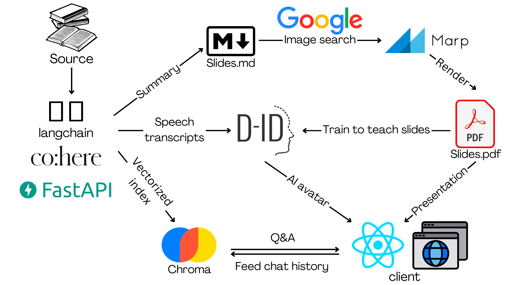

<h1 align="center">
  <br>
  
  <br>
</h1>

<h2 align="center">Turn any textbook into your personal AI professor 👩‍🏫</h2>

<p align="center">
  <a href="#key-features">Key Features</a> •
  <a href="#how-it-works">How It Works</a> •
  <a href="#how-to-use">How To Use</a> •
  <a href="#support">Support</a>
</p>

## Key Features

Prof AI is an AI-powered web app that transforms your boring studying materials ( textbooks, papers and lecture notes, etc.) into an interactive learning experience that actually doesn't suck.

With Prof AI, your tedious textbook becomes:

1. Your very own AI professor who teaches you stuff in a way you'll actually remember. Choose from tons of teaching styles - everything from humorous to engaging storytelling. Your AI prof knows how to keep things fun while helping the knowledge sink in.

2. Presentation slides filled with pictures, graphics and animations that bring concepts to life on screen. Understand hard concepts in one glance of the crafted illustrations.

3. A 24/7 Q&A space where you chat with your virtual professor and get instant answers to any questions you have. Stuck on a problem? Confused by a concept? Just ask and your AI prof will respond with helpful explanations using his or her vast knowledge.

This project was submitted to [LA Hacks 2023](https://devpost.com/software/prof-ai).

## How It Works

<h1 align="center">
  
</h1>


First of all, the user uploads a studying resource in any format, including documents, website links, videos, etc. We use [LangChain loaders](https://python.langchain.com/en/latest/modules/indexes/document_loaders.html) for different formats parse the resource to texts.

The parsed text goes into three pipelines:

1. Slides pipeline

    We prompt-engineered [OpenAI GPT](https://platform.openai.com/docs/introduction) to summarize the parsed text as slides in markdown format. Then, GPT extracts keywords from the generated slides, search for images relating to the keywords using [Google Image Search](https://pypi.org/project/Google-Images-Search/), and insert the images into the slides. Finally, we convert the slides in markdown format into PDF using [Marp](https://marp.app/), and render it in React using [React-pdf](https://react-pdf.org/).

2. Speech transcript pipeline

    After feeding the parsed text and generated slides into GPT, prompt-engineered it to generate a speech transcript to teach the slides using the textbook material, as if it were a professor. We feed the speech transcript into [Chat.D-ID](https://www.d-id.com/api/), where it generates an AI avatar that reads out the transcript like a real person.

3. Q&A pipeline

    We split the parsed text into chunks, convert them into text embeddings, and index them using the vector database [Chroma](https://www.trychroma.com/). When user inputs a question, we do similarity search to get top-k chunks that are most similar to the question. Then, we feed the top-k chunks into GPT as context. GPT answers the question based on the given context. To enable conversational memory, we update chat history after each Q&A, and feed the chat history into GPT as context. We use [Chatbot UI](https://github.com/mckaywrigley/chatbot-ui) as our UI for the Q&A space.

We use different chains in LangChain to achieve these three pipelines. We use [Summarization Chain](https://python.langchain.com/en/latest/modules/chains/index_examples/summarize.html) for slides & speech transcript chain. We use [ConversationalRetrievalQAChain](https://js.langchain.com/docs/modules/chains/index_related_chains/conversational_retrieval) in Q&A pipeline.

## How To Use

Install [Marp](https://marp.app/) on your machine.

```sh
# Linux / MacOS
$ brew install marp

# Windows
$ scoop install marp
```

Install dependencies. 

```sh
$ cd backend
$ pip install -r requirements.txt
$ cd ../frontend
$ npm i
$ cd ../frontend-qa
$ npm i
```

Add your API keys to `backend/app/.env`. Get `OPENAI_API_KEY` from [here](https://platform.openai.com/account/api-keys) and  `GOOGLE_API_KEY` from [here](https://developers.google.com/custom-search/v1/overview).

```js
OPENAI_API_KEY=<your_api_key>
GOOGLE_API_KEY=<your_api_key>
```

Run backend & frontend on localhost (best in parallel terminals).

```sh
$ cd backend
$ uvicorn --app-dir=./app main:app --reload
$ cd ../frontend
$ npm run dev
$ cd ../frontend-qa
$ npm start
```

You should be able to see the application running at http://localhost:3000.


## Support

If you like this project, please leave a star ⭐️. This helps more people to know this project.

Welcome to contribute to this project!

